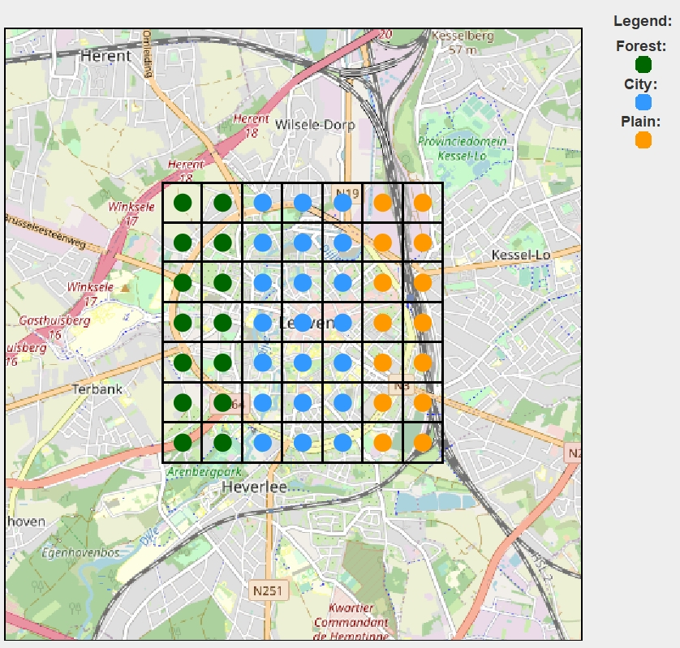
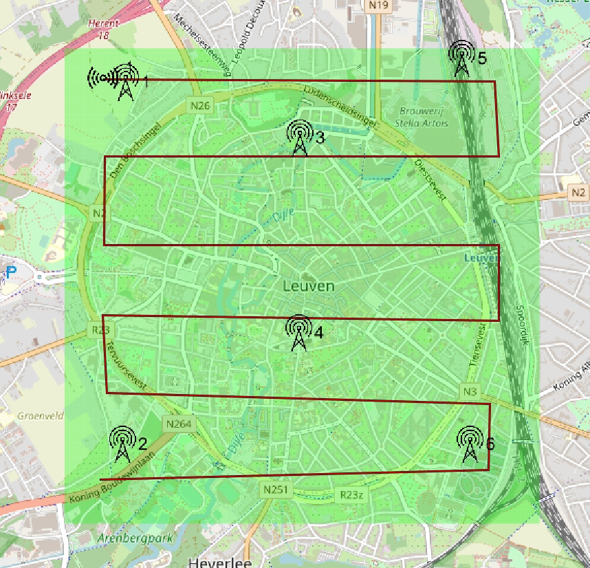
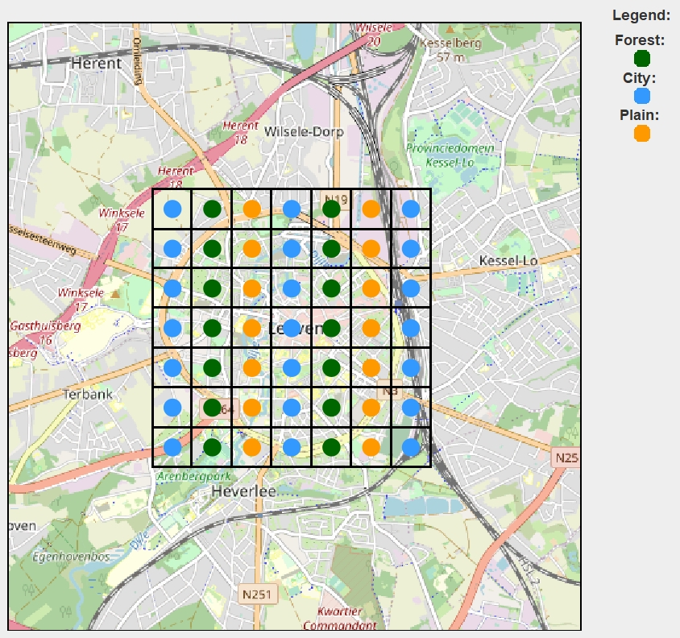
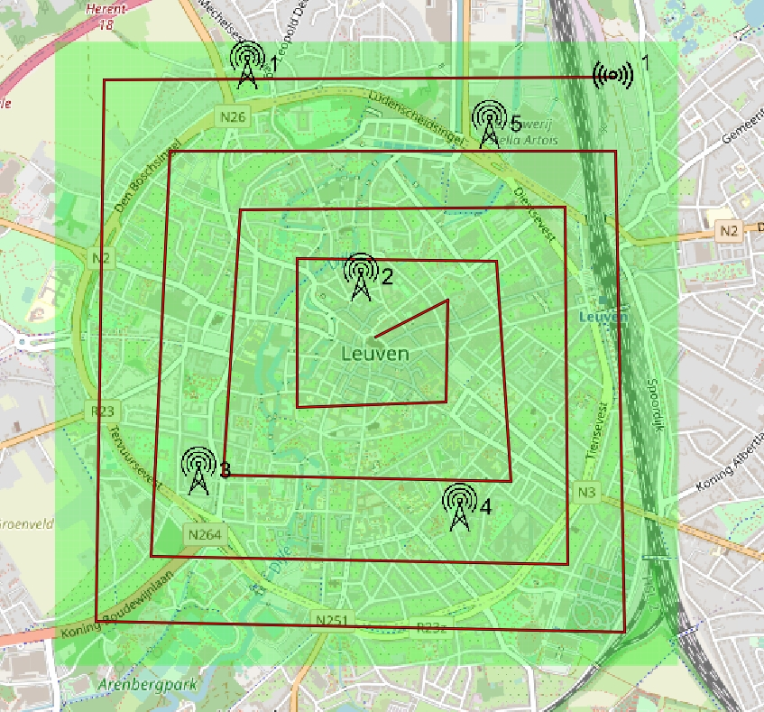
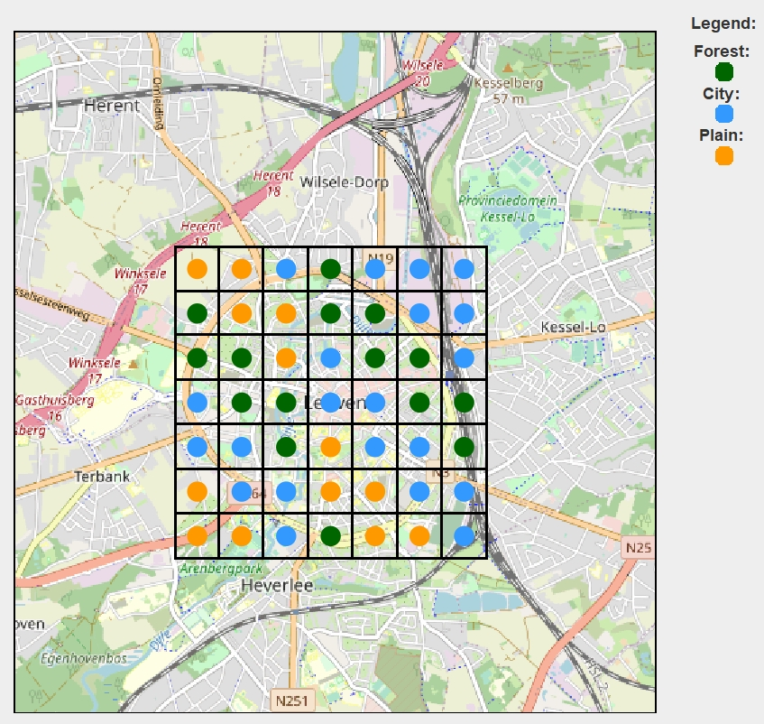
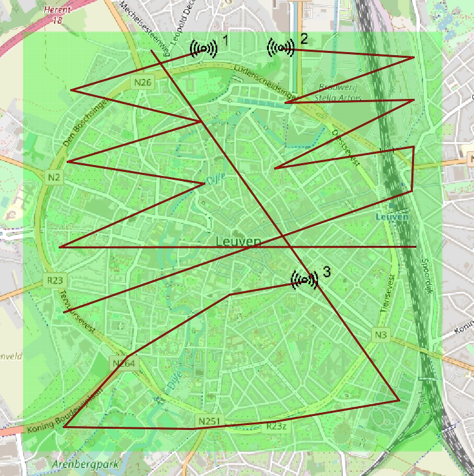
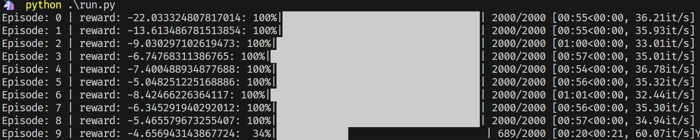

# UPISAS
## Group 5-2
Unified Python interface for self-adaptive system exemplars.

## Prerequisites 
Tested with Python 3.9.18

## Installation
In a terminal, navigate to the parent folder of the project and issue:
```
pip install -r requirements.txt
```
## Run DingNet first
It is recommended to run DingNet locally rather than in Docker, as this allows you to see what the map looks like and how the mote moves on the map directly through DingNet.

## Run
In a terminal, navigate to the parent folder of the project and issue:
```
python run.py [options]
```
Run `python run.py --help` to know how to use options.

Options:

--debug: Run in debug mode, If set true, then UPISAS will directly contact with localhost:8080. If set false, then UPISAS will try to start docker first.

--config: The configuration file to be loaded by DingNet. Selecting a config file is mandatory. Currently 3 config files are provided: world_1_6g1m.xml, world_2_5g1m.xml, world_3_3g3m.xml.

--speed: Simulation speed

--algorithm: Adaptation algorithm to use, select from [DQN_discrete, Signal_based]

--mode: Mode to use, select from [learning, normal]

### world_1_6g1m.xml



### world_2_5g1m.xml



### world_3_3g3m.xml



## Guide
The next three modes are implemented and any other option pairing may result in undefined exceptions.

### How to start a learning

#### Options
algorithm = 'DQN_discrete'

mode = 'learning'

config = Any legal config file, it is best to use the files we provide.

#### Learn

After fully started the DingNet, run `run.py` with options, you will see the learning progress bar. The progress bar will show the average reward and episode progress for the episode, which is 2000 steps per episode, with checkpoints saved every 1000 steps. At first episode rewards will be as low as -20, but after several episodes rewards will gradually increase to -10 or more. Eventually, after sufficient training, the reward can reach -3 or more. You can stop at any time, as long as you think you've learned enough. The learning process itself does not automatically terminate unless an exception is encountered.



### How to use trained model

#### Options
algorithm = 'DQN_discrete'

mode = 'normal'

config = Any legal config file, it is best to use the files we provide.

#### Use

After fully started the DingNet, run `run.py` with options, You will see the average reward being output on the console. If you want to see some charts, it is recommended to use the local version of DingNet and use the plotting features it comes with.


### How to use Baseline

#### Options
algorithm = 'Signal_based'

mode = 'normal'

config = Any legal config file, it is best to use the files we provide.

#### Use
After fully started the DingNet, run `run.py` with options, You will see the average reward being output on the console. If you want to see some charts, it is recommended to use the local version of DingNet and use the plotting features it comes with.